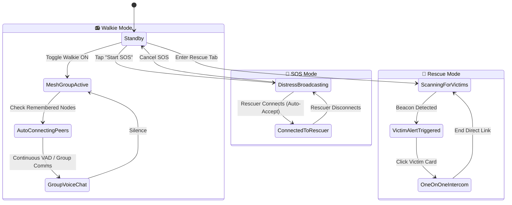

# iTantra — Tactical Off-Grid Transceiver & Disaster Rescue System
## Product Requirements & UI/UX Architecture Specification

---

## 1. Executive Summary & Core Motive

**iTantra** is a mission-critical, completely off-grid peer-to-peer communication system designed for disaster zones, collapsed infrastructure, and tactical rescue scenarios where cellular networks and internet connectivity are unavailable.

The application is structured into **4 distinct, purpose-driven modes** accessible via the persistent bottom navigation bar:

```
┌────────────────────────────────────────────────────────┐
│                   iTantra Architecture                 │
└────────────────────────────────────────────────────────┘
  │
  ├── 1. 🚨 SOS (Distress / Trapped Victim Mode)
  ├── 2. 📻 Walkie (Team / Group Tactical Voice Mesh)
  ├── 3. 🦺 Rescue (First Responder / Search & Rescue Hub)
  └── 4. ⚙️ Settings (Neural Model Hub & Radio Tuning)
```

---

## 2. Global Design Language & Aesthetic System

Following the approved reference design:
* **Visual Style**: Clean, modern tactical aesthetic (supporting both **Tactical Clean Light** as shown in reference and **OLED Stealth Dark**).
* **Color Palette**:
  - **Primary Brand**: Electric Blue / Deep Indigo (`#2563EB` / `#3B82F6`)
  - **SOS Distress**: High-Visibility Crimson Pulse (`#EF4444` / `#DC2626`)
  - **Rescue Amber**: Tactical Warning Amber / Gold (`#F59E0B` / `#D97706`)
  - **Mesh Emerald**: Active Carrier Green (`#10B981`)
  - **Surface & Cards**: Elevated rounded cards (`20dp` radius), subtle borders (`1dp` stroke), soft depth drop-shadows.
* **Header Architecture**:
  - Top Left: App Icon badge (`iTantra`) + Subtitle (`OFF-GRID TELEMETRY`).
  - Top Right: Real-time Status Pill (`● Peer Mesh: Active` / `12ms latency`).
* **Persistent Bottom Navigation**:
  - Exactly 4 items: `SOS`, `Walkie`, `Rescue`, `Settings`.
  - Dynamic notification badges (e.g. pulsing red badge on `Rescue` when victims are detected).

---

## 3. Screen-by-Screen Detailed Specifications

### Mode 1: 🚨 SOS (Distress & Victim Broadcast)

#### Purpose & User Story:
For an individual trapped under debris, injured in a flood/earthquake, or in immediate life-threatening danger. The victim needs help fast with zero technical friction.

#### UI Components & Flow (Matches Reference Mockup):
1. **Header**:
   - `iTantra` title + `OFF-GRID TELEMETRY` tag.
   - Live Connection Status pill (`● Peer Mesh: Standby / Broadcasting`).
2. **Radio Hardware Control Cards**:
   - **Wi-Fi Direct Card**: Icon, title `WI-FI DIRECT`, `P2P Ready` badge, stats (`12ms latency • 8 Nearby nodes`), switch toggle.
   - **Bluetooth Card**: Icon, title `BLUETOOTH`, `BLE Mesh` badge, stats (`Broadcasting emergency beacon`), switch toggle.
3. **Language Selector Card**:
   - Title: `LANGUAGE` with currently selected dropdown header (`e.g., Hindi (हिन्दी)`).
   - Radio list of native scripts (`Hindi`, `English`, `Tamil`, `Bengali`, `Marathi`, `Telugu`, `Gujarati`, `Kannada`, `Malayalam`, `Odia`).
4. **Hero SOS Activation Button**:
   - Giant circular red button centered at bottom with multi-layer animated pulsing glow rings.
   - Inside button: `▲ EMERGENCY` + `SOS` (Bold, 32sp) + `🎤 Voice Agent` icon.
   - Subtitle below button: *"Tap in emergency to initiate Voice Assistant & broadcast distress telemetry to nearby mesh nodes"*.

#### Functional Logic & Behavior:
* When **SOS** is tapped:
  1. Phone enters **Active Distress State**.
  2. Wi-Fi Direct and BLE continuously advertise high-priority distress beacons containing device callsign, battery level, estimated location/altitude, and spoken language.
  3. **Vibration Alert Trigger**: Nearby phones in *Rescue Mode* immediately start vibrating.
  4. **Zero-Friction Hands-Free Intercom**:
     - When a rescuer clicks to connect, **no confirmation dialog is shown to the victim**.
     - The channel opens automatically in full duplex speakerphone.
     - If the victim is unable to move their hands, the rescuer can talk to them directly, and the victim's voice will stream back via microphone.

---

### Mode 2: 📻 Walkie (Tactical Team Group Comms)

#### Purpose & User Story:
For search teams, tactical personnel, and family groups operating in the same disaster quadrant who need hands-free, push-free, or push-to-talk group communication.

#### UI Components & Flow:
1. **Master Walkie Toggle**:
   - Top banner: `WALKIE-TALKIE NETWORK` with master switch (`Active` / `Standby`).
2. **Paired & Persistent Devices (Remembered Group)**:
   - Header: `PAIRED TEAM NODES (3 Connected)`
   - Cards showing each saved team member (Callsign, Protocol, Battery, Signal dBm).
   - **Auto-Reconnect**: Once paired, devices remember each other. Entering Walkie mode connects them automatically with no manual pairing prompt.
   - **Unpair/Delete Action**: Swipe-to-delete or trash icon to remove a node from the group.
3. **Nearby Discovered Nodes (New Devices)**:
   - Header: `AVAILABLE NODES NEARBY`
   - List of unlinked devices broadcasting in Walkie mode with a prominent `+ Pair` button.
4. **Live Transceiver Stage**:
   - Real-time animated waveform equalizer showing network voice activity.
   - **Hands-Free VAD (Voice Activity Detection)**:
     - Voice is automatically detected when speaking starts.
     - Dynamic audio rings illuminate.
     - When user stops talking, message is packaged and broadcast to all paired devices in the room.
   - Optional Manual PTT Override button for noisy environments.

---

### Mode 3: 🦺 Rescue (First Responder & SOS Victim Sonar)

#### Purpose & User Story:
For first responders, NDRF / SDRF teams, volunteers, and doctors searching for trapped victims. When arriving on disaster ground, turning on Rescue Mode scans for distress signals.

#### UI Components & Flow:
1. **Sonar / Radar Scanner Visualizer**:
   - Concentric radar sweep displaying nearby active distress beacons.
2. **Haptic & Acoustic Victim Alert**:
   - As soon as an SOS beacon is detected in range, the phone triggers a distinct **Tactical Vibration Pulse & Emergency Chime**.
   - Top alert banner: `⚠️ 2 VICTIMS IN CRITICAL DISTRESS NEARBY`.
3. **Discovered Victims Queue (1-on-1 Direct Connect Cards)**:
   - Detailed victim card for each distress beacon:
     - Victim ID: `VICTIM-NODE-89`
     - Distance Estimation / Signal: `High Signal (-48 dBm) • ~15 meters`
     - Language Spoken: `Hindi (हिन्दी)`
     - Battery: `18% (Critical)`
     - Distress Time: `Active for 8 mins`
4. **Instant 1-on-1 Direct Intercom**:
   - Rescuer taps **"Connect Directly"** on any victim card.
   - **No Approval Needed**: The connection bypasses handshake confirmation on the victim side and connects immediately.
   - Rescuer can speak into mic (synthesized in victim's language), listen to ambient room noise, and view real-time transcribed audio.

---

### Mode 4: ⚙️ Settings (Neural Engine & Telemetry Hub)

#### Purpose & User Story:
Configuration of on-device AI models, radio mesh parameters, callsigns, and accessibility settings.

#### UI Components & Flow:
1. **Device Identity & Callsign**:
   - Callsign field (`e.g., RESCUE-UNIT-ALPHA` or `CIVILIAN-TERMINAL-01`).
   - Role badge (`RESCUER`, `CIVILIAN`, `RELAY_NODE`).
2. **On-Device AI Engine Diagnostics**:
   - STT Engine: `AI4Bharat IndicConformer INT8 (64.5 MB)` — Status: Ready.
   - TTS Engine: `FastPitch + HiFi-GAN ONNX (130 MB)` — Status: Ready.
   - Language Pack Manager (Check installed language models).
3. **Hardware Radio & Mesh Settings**:
   - Wi-Fi Direct Channel selection (2.4 GHz vs 5 GHz).
   - BLE Beacon Transmission Interval (Balanced vs Extreme Battery Saver).
   - Force Maximum Volume for Emergency SOS Alerts (override system mute).
4. **App Theme**:
   - Segmented selector: `Tactical Light` (Reference Mockup) / `Stealth Dark` / `System`.

---

## 4. State Transition & Mesh Protocol Architecture



---

## 5. Technical Implementation Roadmap

### Phase 1: Navigation & State Foundation
- Replace 5-item navigation with the new 4-item bottom bar: `SOS`, `Walkie`, `Rescue`, `Settings`.
- Implement `NavigationDestination` enum: `SOS`, `WALKIE`, `RESCUE`, `SETTINGS`.
- Update `MissionControlViewModel` to support:
  - `sosActive: Boolean`
  - `activeDistressVictims: List<DistressVictim>`
  - `pairedWalkieNodes: List<PeerDevice>`
  - `discoveredWalkieNodes: List<PeerDevice>`

### Phase 2: SOS Screen Redesign (Faithful to Reference Mockup)
- Clean card-based layout with Wi-Fi Direct & Bluetooth toggle switches.
- Language selection card with native Indic language chips/radios.
- Hero pulsing red SOS button with concentric animated canvas rings.

### Phase 3: Walkie-Talkie Screen
- Paired persistent team nodes with unpair/delete action.
- Nearby discovered nodes list with `+ Pair` CTA.
- Hands-free VAD voice visualizer with animated speech bars.

### Phase 4: Rescue Screen
- Sonar radar scanning animation.
- Emergency vibration trigger simulation.
- Victim list with distance estimation and 1-click direct connect.

### Phase 5: Settings Screen
- Clean card sections for Callsign, AI Neural Models, Mesh Radios, and Theme Mode.

---

*Document approved for technical implementation.*
